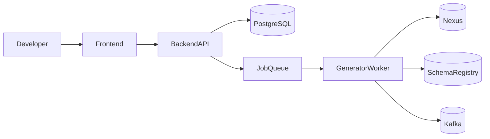

# Architecture

## Components

- Backend API: uploads contracts, stores versions, starts jobs
- Worker: runs OpenAPI/AsyncAPI pipelines
- Compatibility Engine: classifies breaking vs compatible changes
- Publisher: tracks publication status for Nexus and Registry
