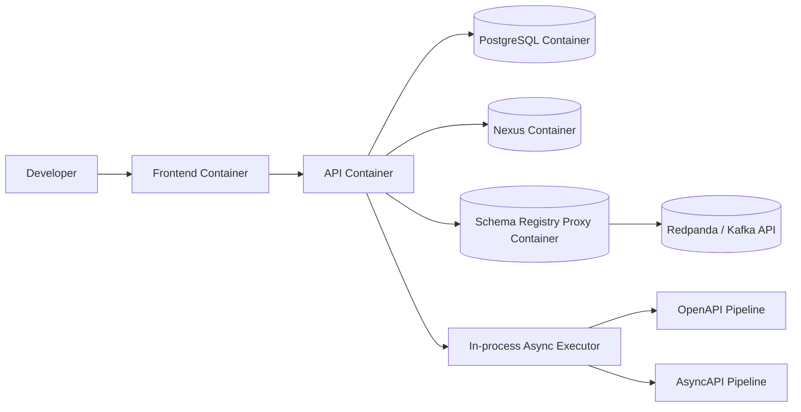

# Architecture

This document reflects the actual runtime used in the project as of P2.

## Runtime Topology (Actual)

## Runtime Notes

- There is no standalone worker container in `infra/docker-compose.yml`.
- The `worker` module is packaged as a dependency and executed inside API process.
- "Queue" is represented by persisted job states (`PENDING`, `RUNNING`, `SUCCESS`, `FAILED`) plus asynchronous execution through `generationTaskExecutor`.
- AsyncAPI publication uses Schema Registry endpoints through `schema-registry` proxy and Redpanda built-in schema registry backend.

## Components and Responsibilities

- **Frontend**: demo UI for upload/history/generate/read-models.
- **API + Orchestrator**: contract upload, compatibility checks, job orchestration, security, observability.
- **Worker Pipelines (in-process)**: OpenAPI and AsyncAPI generation and publication flow.
- **Persistence**: PostgreSQL stores contracts, versions, jobs, artifacts, compatibility reports, publication logs.
- **External Artifact/Schema Infra**: Nexus for Maven artifacts, Schema Registry for event schema versions.

## Verifiable Artifacts

- Runtime definition: `infra/docker-compose.yml`
- Async execution config: `backend/api/src/main/java/ru/vkr/contracts/api/config/AsyncConfig.java`
- Job orchestration: `backend/api/src/main/java/ru/vkr/contracts/api/service/GenerationJobProcessor.java`
- OpenAPI pipeline: `backend/worker/src/main/java/ru/vkr/contracts/worker/generation/openapi/OpenApiPipeline.java`
- AsyncAPI pipeline: `backend/worker/src/main/java/ru/vkr/contracts/worker/generation/asyncapi/AsyncApiPipeline.java`
